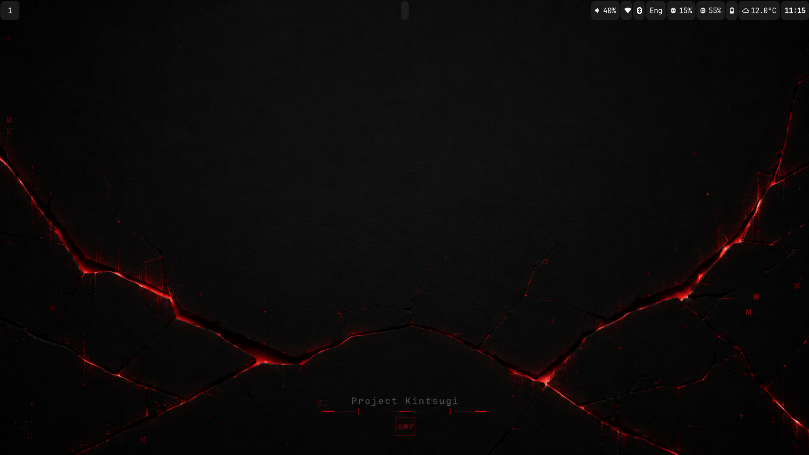

# Project Kintsugi

> A personal journey to build a minimalist, reproducible, and fully understood Linux desktop.



## Why Project Kintsugi Exists

Project Kintsugi was born from a simple idea: a work environment should adapt to its user, not the other way around. This project is not about building the most beautiful Linux desktop, nor about collecting the latest tools or following trends. Its purpose is to build a desktop environment that reflects the way I think, learn, and work.

The final goal is not simply to use Linux, but to understand it deeply enough to confidently build, maintain, and evolve my own environment.

## The Kintsugi Rules

This project is governed by a strict engineering mindset. The following rules guide every addition or modification to the system:

* **Rule 0:** If a decision cannot be explained, it should not be implemented.
* **Rule 1:** Do not install everything at once.
* **Rule 2:** If within six months we don't remember why we installed something, we probably shouldn't have installed it.
* **Rule 3:** We do not document the present. We document the reason.
* **Rule 4:** Every important decision must answer three questions: Why? What problem does it solve? What trade-offs does it introduce?
* **Rule 5:** Choose the best tool for the job, not the most fashionable one.
* **Rule 6:** Evaluate software by its behavior, not by the language it was written in.
* **Rule 7:** Optimization is the result of understanding, not the objective itself.

## Technical Architecture

* **Base System:** Fedora Linux (KDE Plasma spin)
* **Compositor:** Hyprland
* **Configuration Management:** GNU Stow
* **Automation:** Idempotent Bash Orchestration
* **Disaster Recovery:** BTRFS (System Snapshots) + rclone CLI (Data Sync)

## Installation & Reproduction

The entire desktop environment has been automated and codified. It can be fully restored from a fresh Fedora installation using the bootstrap script.

```bash
git clone <repository_url> ~/projects/Project-Kintsugi
cd ~/projects/Project-Kintsugi
./scripts/bootstrap.sh
```
For the complete step-by-step reproduction guide, see the [Automated Bootstrap Procedure](docs/implementation/25-automated-bootstrap.md).

## License

This project is open-source and available under the [MIT License](LICENSE).